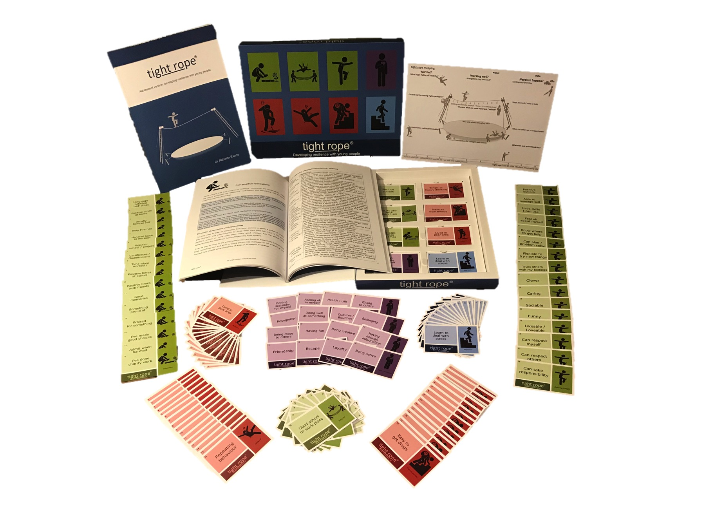

# Resources <small>publications and toolkits</small>

## Publications

["Parenting Orders: The Parents Attend Yet the Kids Still Offend"][parenting-orders], Youth Justice 2012 12: 118, August 2012

This article draws from a wider thesis completed at Bedfordshire University (Vlugter, 2009 'Too Little, Too Late: Parenting Orders as a form of crime prevention'). It presents results from an empirical case study that involved 148 cases and examines the circumstances of parents attending programmes, their attendance and the young people’s recorded offending before and after the intervention, considering the type of intervention and number of sessions attended. 

["Why Don’t We Listen? Parents of high-level offenders asked for help before their child’s first offence"][Backstop listen], Backstop Support Ltd blog, June 2014

This paper also drew on some of the wider thesis (Vlugter, 2009) and provides data that indicates that a large majority of parents of 'high end'offenders had called for help before their child's first recorded offence. The help was often sought from statutory services but with negative results. This paper considers how professionals can support families earlier and more effectively.

["Balancing positive engagement and transparent risk analysis with volatile youth: Introducing the Tightrope Tool"][Introducing Tightrope], Howard League What is Justice? Working Papers 18/2015 

This paper presents a tool that encourages the engagement of the young person in the analysis of their risks, strengths and needs and in the planning of actions based on a balanced and transparent holistic assessment. It will introduce the analogy of the Tightrope, outline how it fits with current assessment frameworks to support an integrated approach and considers the role of the practitioner to apply a person-centred, strength-based approach with the tool. This paper will outline why an integrated and interactive holistic tool for volatile youth would be of benefit to both young people and professionals from various disciplines and concludes with an invitation to experienced practitioners to trial the tool in wider practice.

[parenting-orders]: http://yjj.sagepub.com/content/12/2/118.abstract
[Backstop listen]: http://media.wix.com/ugd/03d98d_aa012ae8a413456d9d78fbbfc2c91753.pdf
[Introducing Tightrope]: http://howardleague.org/wp-content/uploads/2016/04/HLWP_18_2015.pdf

## Tightrope toolkit

Want to engage young people in open discussions about their behavior and choices?

Regardless of a young person’s behavior this toolkit offers a holistic approach in social work, youth offending, substance misuse work, mental health or wellbeing support.

The toolkit includes:
-	Easy to follow 1 page form to capture the views of the young person
-	8 sets of cards to reflect on risks, motives and resilience factors 
-	16 prompts per set, all numbered and referenced in the manual 
-	84 page manual with evidence-led guidance using research from a range of disciplines
-	1 page guidance sheet with inform prompts to be photocopied from the manual
-	Evaluation tool to use at the start and end of interventions

Supporting current approaches of trauma informed practice, Signs of Safety®, GoodLives, Desistance Theory and Motivational Interviewing the toolkit is based on an analogy that being a teenager can be like walking on a Tightrope and supports an open discussion to reflect on key areas within assessments and plans:

-	Falling Off – the behavior we are worried might happen in the future
-	Safety Net – those who support and help now
-	Steps up  – current worries or complicating factors making the risk higher
-	Balancing Strengths – individual strengths to help manage the situation
-	Muddy Path – experiences in the past that makes things volatile now
-	Foundations – times of success and exceptions to harm
-	Central values – the intentions and motives of past or future behaviour
-	Steps Down – actions needed / planning for future goals and safe ground

### Order the full toolkit for just £89.00 (no VAT)

A sample handbook with blank template and inform guidance is also available on request.  

Email: [info@vlinder.co.uk](mailto:info@vlinder.co.uk)

> "I got more in that tightrope in one session than I’d done in 10 weeks"  
> <small>Wandsworth Locality Youth Work Manager (working with CSE and gangs)</small>

> "What a can of worms (information) in 10 years I have not managed to gain so much info in one session using such an effective assessment tool. Wow….."  
> <small>Bail and Remand Officer in Hammersmith and Fulham</small>

> "They can see what's going wrong and the patterns...They can identify better choices...It's visual and they get it."  
> <small>Feedback from young people and workers in Wandsworth</small>

> "They have been able to identify intentions and motivations which they hadn't previously."  
> <small>Practitioner in Lambeth Youth Offending Service</small>

> "There is nothing in a caterpillar that tells you it's going to be a butterfly."
> <small>Richard Buckminster Fuller</small>
